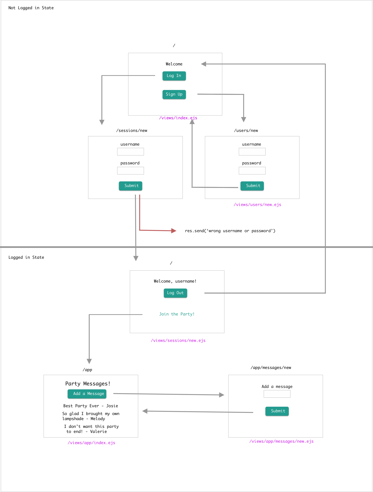

# The Captain's Log Cont.

#### Learning Objectives
- Add authentification to your Captain's Log App.
#### Prerequisites
- JavaScript
- Express / Node
- Mongo / Mongoose
- Express Session
- Bcrypt
### Deliverables
- Full CRUD on logs.
- Add Auth/sessions so a user can sign up, sign in, and log out.
- Password hashed with bcrypt.
- Logs can only be seen if the user is signed in.
- When the user is logged in they should have a welcome message including their username somewhere.
---
### Application Flow/File Structure

## Set-Up
### Set-up bcrypt
- Install bcrypt
`npm install bcrypt --save`
- Require bcrypt in neccesary files
- Make sure your users controller is set up in a way that when a user is created their password is hashed
### Models
- cd into your models folder
- Touch `users.js`
- Create a Schema for users
### Controllers
- cd into your controllers folder
- Touch `users.js` and `sessions.js`
### Users and Sessions Views
- cd into your views folder
- mkdir users folder and sessions folder
- cd into users folder and touch `new.ejs` file
- cd into sessions folder and touch `new.ejs`
- In controllers/sessions.js add a home route that renders our our `sessions/new.ejs` from our views folder
- Add form to create new user (include username and password fields)
- Add `/new` routes to render these new views in your `controllers/users.js` and `controllers/sessions.js`
### Edit welcome.ejs View
- Add `<h1>` with a welcome message!
- Add a 'log-in' button that will go to the `sessions/new` route
- Add a 'sign-up' button that will go to the `users/new` route
### Edit Sessions Controller
- Give your router a variable name to make it easy to refference (optional)
- Add new, create and destroy routes
- Export your controller
### Add Express Package Middleware
- Install express-session
`npm install express-session --save`
- Require express-session
`const session = require('express-session');`
- Use express-session package
### Add a Destroy Session Route
- Add form (with submit button) to destroy session on your index.ejs view
- Add delete route to `controllers/sessions.js`
## Hungry For More
- Utilize EJS Partials in your app.
- Add in a navigation bar.
- Style your app with CSS.
## Wildly Ravenous For Even More
#### Add protected routes.

Hint

[Hint!](https://git.generalassemb.ly/Software-Engineering-Immersive-Remote/SEIR-Waverider/blob/master/unit_2/w06d03/homework/hint1.md)
- Add authorization check to controllers/sessions.js (if user is NOT logged-in send them to `/` route)
- Add authentication check to the `logs.js`controller
- Make it so that only the logged in user can edit/delete their posts
- Allow some posts to be public
- If it is a public post allow other users to like it
- Only allow users to like a post one time
- Allow users to unlike a post

- Add a relation between user and logs [Hint](https://mongoosejs.com/docs/populate.html), [Hint 2](https://git.generalassemb.ly/Software-Engineering-Immersive-Remote/SEIR-Waverider/tree/master/unit_2/w06d04/instructor_notes)
