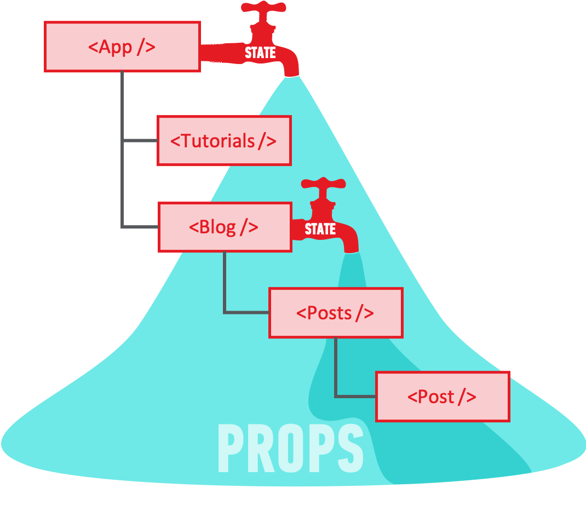

# Intro to React Props

## Learning Objectives

- Learn about props
- Learn how to pass props
- Learn difference between props and state
- Be able to create a component with no state and no props (Header, Footer)
- Be able to create a component with only state (App)
- Be able to create a component with only props (Playlist)
- Be able to create a component with props and state (Song)

## Props

Props is short for properties. We know that a component can have state (a view based on data). If we think back to our React Store, we had just one component. It was a pretty small app, so one component was fine. But as we would continue to build out functionality, our one component would get very complex and the code could expand to hundreds or thousands of lines. Maintaining such a large component would be really hard.

## Data flows down

- In React data only flows down
- You can pass data from a top component down to its children.
- The way you pass them is that you create a custom property and then you can access this data through props in the child component
- the properties that are passed down can be strings, numbers, booleans, arrays, objects, functions etc.



Let's continue to build our app by making a new component Playlist and moving our code into it. Then we'll learn how to pass our playlist data down from the `App` component into the Playlist component.

## Add a New Component

if you haven't already:

- make sure you are on the same level as `package.json`
- `mkdir src/components`
- `touch src/components/PlayList.js`

**src/components/PlayList.js**

```js
import React, { Component } from 'react'

class PlayList extends Component {
  render() {
    return <h3> All the Songs</h3>
  }
}

export default PlayList
```

## Import and render it in our `App.js`

```js
import PlayList from './components/PlayList.js'
```

Between our form and main tags:


Let's **MOVE** our song list to our new component (the main tag and everything inside)

From **App.js**

```js
<main>
  <div>
    <h3>Playlist 1</h3>
    <table>
      <thead>
        <tr>
          <th>Song</th>
          <th>Arist</th>
          <th>Time</th>
        </tr>
      </thead>
      <tbody>
        {this.state.playlist.map((song, index) => {
          return (
            <tr key={index}>
              <td>{song.title}</td>
              <td>{song.artist}</td>
              <td>{song.time}</td>
            </tr>
          )
        })}
      </tbody>
    </table>
  </div>
</main>
```

To **src/components/PlayList**

Right now, we should be getting an error that says `TypeError: Cannot read property 'playlist' of null`. Why is that? Remember, we're referring to `this.state` but there is no state in this component. Instead, we should be getting that information from our parent component, which in this case is our `<App />`. When we are in a child component (`Playlist`) we access information from the parent using `this.props`. Because of this we would access our songs in our `<Playlist>` component using `this.props.playlists.songs`. Update your component so that it looks so:

```js
<tbody>
  {this.props.playlist.map((song, index) => {
    return (
      <tr key={index}>
        <td>{song.title}</td>
        <td>{song.artist}</td>
        <td>{song.time}</td>
      </tr>
    )
  })}
</tbody>
```

Now we are getting a new error `TypeError: Cannot read property 'songs' of undefined`. This means that we are trying to access playlists in our props, but we don't have a playlists key in our `this.props` object. Why? Because we never passed it down from the parent!

Modify our `<Playlist />` in our `<App />` so that we pass down a value. It should look like below:

**App component**

```js
</form>
<Playlist playlist={this.state.playlist} />
<Footer />
```

Now we can access the data we're passing down in our `PlayList` component

## A Component that Has Props and State

First let's practice making a new component

- `touch src/components/Song.js`

```js
import React, { Component } from 'react'

class Song extends Component {
  render() {
    return
  }
}
export default Song
```

Import this component into the `PlayList`

**Playlist.js**

```
import Song from './Song.js'
```

Let's move our `tr`s into this new component

**Song.js**

```js
import React, { Component } from 'react'

class Song extends Component {
  render() {
    return (
      <tr key={index}>
        <td>{song.title}</td>
        <td>{song.artist}</td>
        <td>{song.time}</td>
      </tr>
    )
  }
}
export default Song
```

Update our **PlayList.js** so that we are passing properties down to our Song components.

```js
import React, { Component } from 'react'
import Song from './Song.js'

class PlayList extends Component {
  render() {
    return (
      <ul>
        {this.props.playlists.songs.map((song, index) => {
          return <Song song={song} key={index} />
        })}
      </ul>
    )
  }
}
export default PlayList
```

Update our Song component (we can remove the key property from the `tr` too) so we are rendering our view based on the component's properties.

```js
import React, { Component } from 'react'

class Song extends Component {
  render() {
    return (
      <tr>
        <td>{this.props.song.title}</td>
        <td>{this.props.song.artist}</td>
        <td>{this.props.song.time}</td>
      </tr>
    )
  }
}
export default Song
```

Let's say we want a user to be able to love a song by clicking on a song. If the song is liked, a heart will appear.

Remember, if we want a component to have state we must add the constructor function

```js
class Song extends React.Component {
  constructor() {
    this.state = {
      love: false
    }
  }
  render() {
    return (
      <tr key={this.props.index}>
        <td>{this.props.song.title}</td>
        <td>{this.props.song.artist}</td>
        <td>{this.props.song.time}</td>
      </tr>
    )
  }
}
```

When we run this, we get an error:

```
'this' is not allowed before super()
```

We have to add `super` in. `super` is a keyword that allows us to inherit from the parent class and add add new properties. Look back on the documentation of `classes` for more information. For now, we just have to add some code to our constructor

```js
constructor (props) {
  super(props)
  this.state = {
    love: false
  }
}
```

Now we can conditionally render a heart whether or not an song is loved

```js
return (
  <tr key={this.props.index} onClick={this.toggleLove}>
    <td>{this.props.song.title}</td>
    <td>{this.props.song.artist}</td>
    <td>{this.props.song.time}</td>
    {this.state.love ? <td>&hearts;</td> : <td></td>}
  </tr>
)
```

Let's add a function to allow us to toggle the value

```js
toggleLove() {
  this.setState({love : !this.state.love})
}
```

And remember, we must bind `this` in the constructor

```js
constructor (props) {
  super(props)
  this.state = {
    love: false
  }
  this.toggleLove = this.toggleLove.bind(this)
}
```

Finally, let's add an `onClick` that will allow us to toggle the value of `love` for each song - let's put it on the whole row so our user can click anywhere on the row

```js
<tr onClick={this.toggleLove}>
```

Now, we should be able to click on the item and toggle whether or not we see the message that the item is in the shopping cart.

## Extra Challenges

- double click the song name to delete it from the list
- add functionality that lets you click on an icon (arrow?) of two songs and then swaps their order
- Allow for multiple playlists to be rendered, when adding a new song, let a user select a playlist to add to or to create a new playlist
- make form into its own component
- Add some sweet sweet css style!

Complete Code:

App.js

```js
import React, { Component } from 'react'
import Footer from './components/Footer'
import Header from './components/Header'
import Playlist from './components/Playlist'
import playlist from './data.js'

class App extends Component {
  constructor(props) {
    super(props)
    this.state = {
      playlist: playlist,
      title: '',
      artist: '',
      time: '0:00'
    }
    this.handleChange = this.handleChange.bind(this)
    this.handleSubmit = this.handleSubmit.bind(this)
  }
  handleChange(event) {
    this.setState({ [event.target.id]: event.target.value })
  }
  handleSubmit(event) {
    event.preventDefault()

    const newSong = {
      title: this.state.title,
      artist: this.state.artist,
      time: this.state.time
    }
    console.log(newSong)
    const updatedPlaylist = [newSong, ...this.state.playlist]

    this.setState({
      playlist: updatedPlaylist,
      title: '',
      artist: '',
      time: '0:00'
    })
  }
  render() {
    return (
      <div>
        <Header />
        <form onSubmit={this.handleSubmit}>
          <label htmlFor="title">
            Song
            <input
              type="text"
              id="title"
              value={this.state.title}
              onChange={this.handleChange}
            />
          </label>
          <label htmlFor="artist">
            Artist
            <input
              type="text"
              id="artist"
              value={this.state.artist}
              onChange={this.handleChange}
            />
          </label>
          <label htmlFor="time">
            Time
            <input
              type="text"
              id="time"
              value={this.state.time}
              onChange={this.handleChange}
            />
          </label>
          <label>
            <input type="submit" />
          </label>
        </form>
        <Playlist playlist={this.state.playlist} />
        <Footer />
      </div>
    )
  }
}

export default App
```

Playlist.js

```js
import React, { Component } from 'react'
import Song from './Song.js'

class PlayList extends Component {
  render() {
    return (
      <main>
        <div>
          <h3>Playlist 1</h3>
          <table>
            <thead>
              <tr>
                <th>Song</th>
                <th>Arist</th>
                <th>Time</th>
              </tr>
            </thead>
            <tbody>
              {this.props.playlist.map((song, index) => {
                return <Song song={song} key={index} />
              })}
            </tbody>
          </table>
        </div>
      </main>
    )
  }
}

export default PlayList
```

Song.js

```js
import React, { Component } from 'react'

class Song extends Component {
  constructor(props) {
    super(props)
    this.state = {
      love: false
    }
    this.toggleLove = this.toggleLove.bind(this)
  }
  toggleLove() {
    this.setState({ love: !this.state.love })
  }
  render() {
    return (
      <tr onClick={this.toggleLove}>
        <td>{this.props.song.title}</td>
        <td>{this.props.song.artist}</td>
        <td>{this.props.song.time}</td>
        {this.state.love ? <td>&hearts;</td> : <td></td>}
      </tr>
    )
  }
}
export default Song
```
