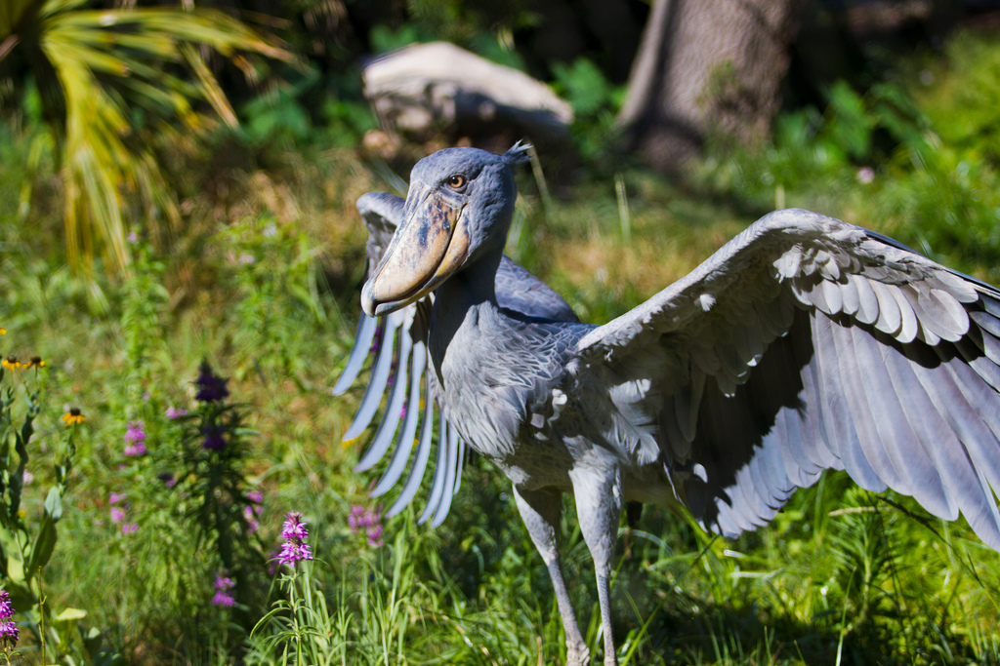

# Audubon Society Bird Photo Contest



Your local Audubon Society has reached out to you to help them put together an online contest.

They want members of the public to go out and take photos of birds and submit them to their website. The best bird photo will honored with a premium Audubon Society membership!

## Deliverables
- Using CRA set up your files, add in your birds and make sure to remove .git
(Note: we'll work on this lab this morning and for hw)

- Users should be able to **Create** a new bird (species, image and person who submitted the image)
- Users should be able to **Read** a list of submitted members' birds

**HFM**
- Users should be able to **Delete** their birds, in case they changed their mind about being in the contest
- Users should be able to **Update** their bird submission approval by clicking a button that says 'approve' when `approved` is false, and the button should read `un-approve` when `approved` is true

## Get Started

 - Here are a few bird submissions to get you started

 ```js
 const birds = [
   {
     birdName: 'Royal Flycatcher',
     image: 'http://media.galaxant.com/000/072/608/desktop-1410170762.png',
     user: 'Veloria',
     approved: false
   },
   {
     birdName: 'Resplendent Quetzal',
     image: 'http://media.galaxant.com/000/072/604/desktop-1410170753.png',
     user: 'Allison',
     approved: false
   },
   {
     birdName: 'Livingstone\'s Turaco',
     image: 'http://media.galaxant.com/000/072/594/desktop-1410170731.png',
     user: 'Rosa',
     approved: true
   },
   {
     birdName: 'Superb Bird-of-paradise',
     image: 'http://www.funcage.com/blog/wp-content/uploads/2011/08/Superb-Bird-of-paradise.jpg',
     user: 'Alexander',
     approved: false
   },
   {
     birdName: 'Tweet_r',
     image: 'https://i.imgur.com/VGAxKX1.png',
     user: 'Debbie',
     approved: false
   },
   {
     birdName: 'King Vulture',
     image: 'https://kids.nationalgeographic.com/content/dam/kids/photos/articles/Other%20Explore%20Photos/R-Z/Wacky%20Weekend/Strange%20Birds/ww-birds-king-vulture.adapt.945.1.jpg',
     user: 'Gibson',
     approved: true
   },
   {
     birdName: 'Secretary Bird',
     image: 'https://kids.nationalgeographic.com/content/dam/kids/photos/articles/Other%20Explore%20Photos/R-Z/Wacky%20Weekend/Strange%20Birds/ww-birds-secretary-bird.jpg',
     user: 'Harold',
     approved: true
   },
   {
     birdName: 'Frilled Coquette Hummingbird',
     image: 'https://78.media.tumblr.com/10ad7398c6cabffe666159b09bf50e57/tumblr_nzt5dl55QF1u38l26o1_500.jpg',
     user: 'Maude',
     approved: false
   },
   {
     birdName: 'Boat-billed Heron',
     image: 'https://i.redditmedia.com/sl3adn3eXY65Y4yNLxMRO_O4y-Pf1EYCxPuHpV34WqI.jpg?fit=crop&crop=faces%2Centropy&arh=2&w=640&s=f461fa6cd525892f85eb89268550867a',
     user: 'Bill',
     approved: true
   },
   {
     birdName: 'Ex-Parrot',
     image: 'https://static.independent.co.uk/s3fs-public/thumbnails/image/2014/07/14/15/MPP.jpg?w968h681',
     user: 'Monty',
     approved: false
   }
 ]
 ```
 - make your browser view more manageable

 ```css
  img {
    max-width: 100px;
  }
 ```

 - Find some unusual bird images here:

  https://www.reddit.com/r/PicsOfUnusualBirds/


## Hungry for More
- Users should be able to **Update** thier birds name, image and user name, in case they made a typo/mistake

- Implement Administrator mode!
    - Make a simple html button that when clicked will toggle whether administrator mode is on/off (true false)
    - When true, there should be new functionality that
      - only allows the administrator to approve entries as valid
      - if an entry is approved, it will render on the page both when administrator mode is on or off
      - if an entry is not approved, it will not be rendered on the page when admin mode is off. In admin mode, it should have a grey background or other visual cue that it is not valid/approved
      - remove the ability for anyone to delete a bird, and only let the administrator delete entries
